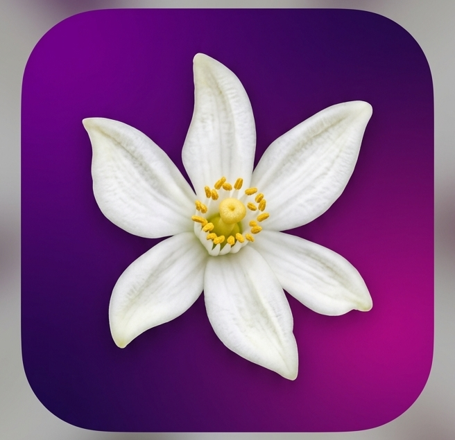

<p align="center">
  
</p>

<h1 align="center">NoctDock Azahar</h1>

<p align="center"><strong>Azahar fork for 3DS top-screen play on your TV</strong></p>

<p align="center">
  <a href="https://github.com/glowseedstudio/noctdock">NoctDock</a> · companion to the sender and receiver apps
  ·
  <a href="docs/USER_GUIDE.md">User guide</a>
</p>

NoctDock Azahar is a custom build of [Azahar](https://github.com/azahar-emu/azahar) for people who use **NoctDock** on Android handhelds. It keeps normal 3DS emulation on the device, and can send **only the top screen** to a **NoctDock Receiver** on your LAN while the bottom screen, touch, and controls stay on the handheld.

No accounts. No cloud relay. No analytics. Local network only.

Package: `com.glowseed.noctdock.azahar` (debug: `com.glowseed.noctdock.azahar.debug`)

---

## Downloads

Pre-built APKs are on [**GitHub Releases**](https://github.com/glowseedstudio/noctdock-azahar/releases/latest) (Android 10+, arm64 or x86_64).

| APK | Package | When to use |
| --- | --- | --- |
| **`*-debug.apk`** | `com.glowseed.noctdock.azahar.debug` | Testing and logs; installs next to release. |
| **`*-release.apk`** | `com.glowseed.noctdock.azahar` | Day-to-day sideloading (minified). |

You still need **NoctDock Sender** and **NoctDock Receiver** from the [noctdock](https://github.com/glowseedstudio/noctdock) repo. Enable install from unknown sources (or your files app) before installing.

**Build locally** (after `git clone --recursive`):

```bash
cd src/android
JAVA_HOME=/usr/lib/jvm/java-17-openjdk ./gradlew :app:assembleVanillaDebug :app:assembleVanillaRelease
```

APKs land under `src/android/app/build/outputs/apk/vanilla/{debug,release}/`.

**Publish a release** (maintainers): tag `v*` (e.g. `v0.1.0`) and push — the [NoctDock Android release](https://github.com/glowseedstudio/noctdock-azahar/actions/workflows/noctdock-android-release.yml) workflow attaches both APKs. Optional repo secrets `ANDROID_KEYSTORE_*` enable Play-style release signing.

---

## Why this is a separate app

3DS games are meant to be played on two screens at once. Mirroring the whole Android UI to a TV works for many apps, but it is not the same as a real top-and-bottom layout.

I wanted the TV to show the **game’s top screen** and the handheld to stay the **bottom screen and controller** — without turning NoctDock into a monolithic emulator build. Keeping Azahar as its own fork keeps upstream attribution clear, GPLv2 compliance straightforward, and the emulator easier for others to hack on.

---

## How it fits with NoctDock

You need **NoctDock Sender** on the handheld and **NoctDock Receiver** on the TV (or another Android display). This APK is the emulator that exports the top screen when **NoctDock 3DS Mode** is active.

**Launch** from the sender opens Azahar like any other app while the sender mirrors the full Android display (Console Mode). That path does not start top-screen export by itself.

**Launch in 3DS Mode** from the sender checks that Azahar is installed, a receiver is selected, online, and trusted, then opens Azahar with the receiver address, port, negotiated codec, and sound settings. Azahar handles encode and UDP for the top screen; the sender stops its own Console Mode session for that path.

You can also enable **NoctDock 3DS Mode** inside Azahar after a normal launch, once a screen is set up.

**Before 3DS Mode:** pair the TV in NoctDock Sender first, then in Azahar open **Settings → NoctDock 3DS Mode** and set export presets (start with **Balanced**, **Auto** resolution, **30 fps safe**). Adjust **Graphics → Internal Resolution** separately from export size. Full walkthrough: **[User guide](docs/USER_GUIDE.md)**.

---

## What it does

| Area | Summary |
| --- | --- |
| **Top-screen export** | Encoded stream to the paired receiver over the same NoctDock UDP protocol as Console Mode. |
| **Local bottom screen** | Touch and lower display stay on the handheld during export. |
| **Codec negotiation** | AVC or HEVC with fallback if the encoder fails to start. |
| **Bottom-screen dim** | Optional idle dim on the handheld (Off / Gentle / Dark / Maximum) without affecting the TV picture. |
| **Normal Azahar** | Still runs as a full emulator when NoctDock export is off. |
| **Stream Watch** | Optional LAN-only debug metrics when enabled (no cloud telemetry). |

The export path is moving toward **direct render into the encoder surface** where possible, instead of slow full-frame readback.

---

## What it is not

Not a replacement for upstream Azahar for everyone — it is a **NoctDock-focused fork**. Not a cloud service, not a game store, and not bundled with the sender or receiver APKs (those live in the [noctdock](https://github.com/glowseedstudio/noctdock) repo).

---

## Privacy

Same idea as main NoctDock: **local network only.** No accounts, analytics, ads, or remote streaming. Stream Watch, if you turn it on, is for your LAN and debugging — not uploaded anywhere.

---

## License

This tree is a **derivative of Azahar / Citra**, licensed under **GNU GPLv2** (or later). See `license.txt` in the source tree when published. **NoctDock Sender** and **NoctDock Receiver** are separate projects (Apache 2.0 in the noctdock repo). Distributing builds of this fork must follow GPLv2 (source, notices, `license.txt`).

Copyright Citra Emulator Project / Azahar Emulator Project — see [NOTICE](NOTICE).

---

## Current status

In active development. Fork source is in this repository; debug and release APKs are published on [**Releases**](https://github.com/glowseedstudio/noctdock-azahar/releases/latest) when tagged.

For integration detail and testing checklists, see the main NoctDock repo: [`NOCTDOCK_AZAHAR_INTEGRATION.md`](https://github.com/glowseedstudio/noctdock/blob/main/NOCTDOCK_AZAHAR_INTEGRATION.md), [`NOCTDOCK_AZAHAR_TESTING.md`](https://github.com/glowseedstudio/noctdock/blob/main/NOCTDOCK_AZAHAR_TESTING.md).

---

## Contributing

Useful help right now: real-device testing (handheld + receiver), export performance on your GPU, HEVC fallback cases, and clear issue reports with device model, Android version, receiver type, Wi‑Fi vs Ethernet, and selected profile.

When opening issues, do not paste ROM paths or personal data. GPLv2 applies to contributions in the emulator tree.

**Maintainer note:** NoctDock Azahar is maintained in my spare time alongside the main NoctDock apps. I have a full-time job and will do my best to respond to issues as quickly as I can, but I am only human — not Superman. Thank you for your patience.

---

## Links

| | |
| -- | -- |
| **NoctDock (sender / receiver)** | https://github.com/glowseedstudio/noctdock |
| **Upstream Azahar** | https://github.com/azahar-emu/azahar |
